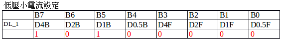

<!-- $theme: gaia -->

# 新電源報告

##### [Mapacode INC](mapacode.tw)

###### Software Engineer: Alvis Lu

---

### 新增參數
- <span style="color:#42affa">在表格上</span>
    - VW, DVw, STD, SFA, SFB, IG
    - SD, WON, WOF, IW, SPARKER, ACO

- <span style="color:#42affa">未在表格上</span>
    - IA, DH_1, ISO (皆為內部變數，使用者無需填入)

---

## 目前進度

---

### 演算法

- <span style="color:#42affa">已實做之參數</span>
	- SD, SFA, SFB, IW, SPARKER
	- ACO, STD, IA, DH_1, ISO
- <span style="color:#42affa">未實做之參數</span>
	- IG
- <span style="color:#42affa">還未理解之參數</span>
	- VW, DVw  (登錄用, 從 Ecode 與 Arcnet 表？)
	- WON, WOF (值的來源？)
- <span style="color:#e49436">待提供 Ecode 與 Apack 表</span>

---

### 人機

- 設定參數位置可顯示表格上新增的**12個**參數。
- <span style="color:#e49436">Ecode 和 Apack 表顯示：待提供參數表</span>

---

## 更仔細的 <span style="color:#e49436">參數說明</span> 與 <span style="color:#e49436">範例</span>

---

#### 原 IA 參數 - 說明

```
IA = IP - IW/2 是由(D8A_1, D8A_2, DL_1(B))三者所構合成的。
最小解析度為0.5
INT(IA/8) 取整數決定D8A_1及D8A_2
IA - INT(IA/8) * 8 <= 7.5   決定DL_1(B)

```

* IA 的範圍? IA不在新增參數表格內 ?!
* IP 是什麼?
* IA = IP - IW/2  是由(D8A_1, D8A_2, DL_1(B))三者所構合成的。
* 什麼參數最小解析度為 0.5 A? D8A_1, D8A_2, DL_1(B) 都是嗎?

@fa[arrow-down]

+++

#### 修改後 IA 參數 - 說明

```
公式: IA = IP - IW/2
```

- IP 為已有參數 real_il。(可查看先前的程式設計)
- 計算後的 IA 需填入 Arcnet 表格中的 D8A_1, D8A_2, DL_1(B) 三個參數, 請查看這三個參數的設定說明。

```
D8A_1, D8A_2 公式：D8A = 取整數 (IA / 8)
DL_1(B) 公式： DL_1(B) = IA - (D8A * 8)
```

+++

#### 修改後 IA 參數 - 實例

```
EX(1): IA = 25.5
D8A = 取整數 (IA / 8) => 3
DL_1 = IA - (D8A * 8) => 1.5

填入 arcnet 表的數值
D8a_1 = 0x0000 0011 (3), D8A_2 = 0x0000 0000 (0)
DL_1(B) = 0x0011 (3)

EX(2): IA = 2058.5
D8A = 取整數 (IA / 8) => 257
DL_1 = IA - (D8A * 8) => 2.5

填入 arcnet 表的數值
D8A_1 = 0x1111 1111 (255), D8A_2 = 0x0000 0010 (2)
DL_1(B) = 0x1111 (15)
```

---

#### 原 D8A 參數

 圖1
 圖2

* 沒有說明如何區分 D8A_1, D8A_2
* D8_* 分代表什麼？
* 圖2 表格沒有說明下方紅色內容的意思？

@fa[arrow-down]

+++

### 修改後 D8A 參數 - 說明

- D8A_1, D8A_2 參數是由 8 的倍數組合而成的 8 位元數。
- D8A_1 的範圍 0 ~ 255。 (0x0000 0000 ~ 0x 1111 1111)
- D8A_2 的範圍 0 ~ 15。  (0x0000 0000 ~ 0x 0000 1111)

+++

### 修改後 D8A 參數 - 實例

```
EX(1):
D8A = 155
D8A_1 = 0x1001 1011 (155), D8A_2 = 0x0000 0000 (0)

EX(2):
D8A = 265
D8A_1 = 0x1111 1111 (255), D8A_2 = 0x0000 1010 (10)

```

---

#### 原 DL_1 參數
 圖1
 圖2

* DL_1 的範圍？
* DL_1 的值是什麼？
* D4B, D2B, D1B, D0.5B 與 D4F, D2F, D1F, D0.5F 差別是什麼？

@fa[arrow-down]

+++

### 修改後 DL_1 參數 - 說明

- DL_1 參數是由 DL_1(B) 與 DL_1(F) 兩個 4 位元數的組合而成。

<span style="color:#e49436">DL_1(B/F) 表</span>

|4 Bit    |Bit_3|Bit_2|Bit_1|Bit_0|備註   |
|---------|-----|-----|-----|-----|-------|
|DL_1(B/F)| 4A  | 2A  | 1A  | 0.5A|電流值 |


<span style="color:#e49436">DL_1 表</span>

|8 Bit| 4 Bit   | 4 Bit   |
|-----|---------|---------|
|DL_1 | DL_1(B) | DL_1(F) |

---

### 修改後 DL_1 參數 - 實例

```
EX(1):

DL_1B = 3.5 , DL_1F = 4
填入 arcnet 表的數值
DL_1 = 0x0111 1000
```

---

## 希望可以提供資料

- <span style="color:#e49436">參數說明</span> 與 <span style="color:#e49436">範例</span> 可以再更仔細。
- 實際給定的參數與其演算實例。
	`(使用者/內部參數 -> 演算法過程 -> Arcnet 表的數值 )`
- 重新說明可以讓使用者修改的參數。
- 要顯示給使用者的參數？
- 是否還有缺少的參數？

---

## 下一步進度

- 用實際演算例證，檢驗已完成的演算法正確性。
- 使用模擬機台測試 <span style="color:#e49436">已實做之參數</span>
- 人機 Ecode table 與 Apack table 可顯示新電源參數。

---

# Thanks ! 

##### [Mapacode INC](mapacode.tw)

###### Software Engineer: Alvis Lu
